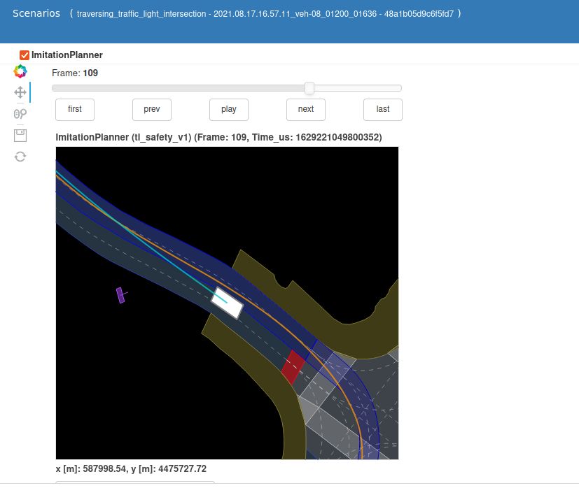
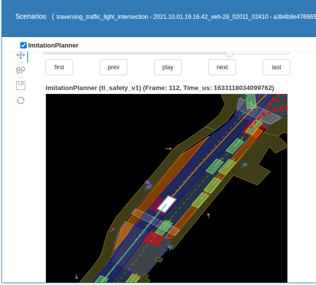
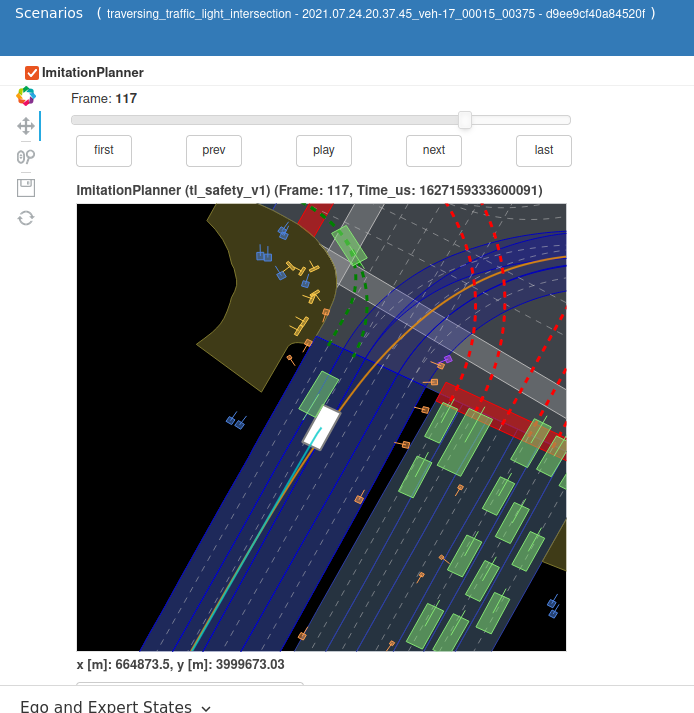
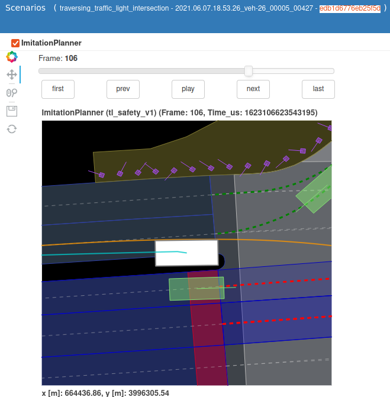

# planTF — extended

Fork of [jchengai/planTF](https://github.com/jchengai/planTF). 

Original paper:

**Rethinking Imitation-based Planner for Autonomous Driving**,
*Jie Cheng, Yingbing Chen, Xiaodong Mei, Bowen Yang, Bo Li and Ming Liu*, arXiv 2023

<p align="left">
<a href="https://jchengai.github.io/planTF">

</a>
<a href='https://arxiv.org/pdf/2309.10443.pdf' style='padding-left: 0.5rem;'>
    
</a>
<a href="../../actions/workflows/ci.yml" style='padding-left: 0.5rem;'>
    
</a>
</p>

<image src="https://github.com/jchengai/planTF/assets/86758357/42170613-8759-4359-80ce-0b17c51676b8" height=400 width=400>
<image src="https://github.com/jchengai/planTF/assets/86758357/2c06a97e-d543-4b82-8a75-bbf859abe148" height=400 width=400>

## What this fork adds

Three independent tracks built on top of the published PlanTF checkpoint (no retraining):

| Track | Key result |
|-------|------------|
| [Geometric mode re-ranking](#geometric-mode-re-ranking) | mini_eval_v2 NR-CLS: 0.8401 → **0.8478** (+0.77%) |
| [Expanded evaluation benchmark](#expanded-evaluation-benchmark) | 84-scenario benchmark across 8 driving situation types |
| [TensorRT + C++ runtime](#tensorrt-and-c-runtime) | 1.2–1.7 ms (TRT FP16/FP32) vs ~20 ms CPU Python; patched model only (see note) |

CI: lint, 16 unit tests, C++ ORT build — runs on every push/PR.

---

## Highlight
- A good starting point for research on learning-based planner on the [nuPlan](https://www.nuscenes.org/nuplan) dataset. This repo provides detailed instructions on data preprocess, training and benchmark.
- A simple pure learning-based baseline model **planTF**, that achieves decent performance **without** any rule-based strategies or post-optimization.

## Contents

- [Setup Environment](#setup-environment)
- [Feature cache](#feature-cache)
- [Training](#training)
- [Trained models](#trained-models)
- [Evaluation](#evaluation)
- [Results](#results)
- [Fork contributions](#fork-contributions)
- [Upstream modifications](#upstream-modifications)
- [Documentation](#documentation)
- [Acknowledgements](#acknowledgements)
- [Citation](#citation)

## Documentation

| Document | What it covers |
|---|---|
| [docs/EVAL_PLAN.md](docs/EVAL_PLAN.md) | Two-tier benchmark strategy, scenario bucket design, mini-split limits, evaluation cadence |
| [docs/mini_scenario_inventory.md](docs/mini_scenario_inventory.md) | Every scenario type in nuplan-v1.1_mini: token counts, log coverage, bucket assignment |
| [inference/README.md](inference/README.md) | ONNX export scripts, all 5 NATTEN/compatibility patches, fidelity tables, IO shapes |
| [inference/FIDELITY_REPORT.md](inference/FIDELITY_REPORT.md) | Numeric fidelity ablation: Original vs Patched vs ONNX vs TRT |
| [inference/deploy/TENSORRT_REPORT.md](inference/deploy/TENSORRT_REPORT.md) | TensorRT FP32/FP16 latency and fidelity results |
| [cpp/README.md](cpp/README.md) | C++ ORT/TRT build instructions |
| [cpp/CPP_RUNTIME_REPORT.md](cpp/CPP_RUNTIME_REPORT.md) | C++ vs Python ORT output validation and latency numbers |
| [BRANCHING.md](BRANCHING.md) | Branch history and guard rules for this fork |


## Setup Environment

- setup the nuPlan dataset following the [offiical-doc](https://nuplan-devkit.readthedocs.io/en/latest/dataset_setup.html)
- setup conda environment
```
conda create -n plantf python=3.9
conda activate plantf

# install nuplan-devkit
git clone https://github.com/motional/nuplan-devkit.git && cd nuplan-devkit
pip install -e .
pip install -r ./requirements.txt

# setup this fork
cd ..
git clone https://github.com/apr/planTF.git && cd planTF
sh ./script/setup_env.sh
```

## Feature cache

Preprocess the dataset to accelerate training. The following command generates 1M frames of training data from the whole nuPlan training set. You may need:
- change `cache.cache_path` to suit your condition
- decrease/increase `worker.threads_per_node` depends on your RAM and CPU.

```sh
 export PYTHONPATH=$PYTHONPATH:$(pwd)

 python run_training.py \
    py_func=cache +training=train_planTF \
    scenario_builder=nuplan \
    cache.cache_path=/nuplan/exp/cache_plantf_1M \
    cache.cleanup_cache=true \
    scenario_filter=training_scenarios_1M \
    worker.threads_per_node=40
```

This process may take some time — 20+ hours on the original authors' hardware.

## Training

The training script is from [tuplan_garage](https://github.com/autonomousvision/tuplan_garage), lightly modified by the original authors for flexibility.
By default it uses all visible GPUs. PlanTF is lightweight — around 4–6 GB GPU memory per GPU at batch size 32.

```sh
CUDA_VISIBLE_DEVICES=0,1,2,3 python run_training.py \
  py_func=train +training=train_planTF \
  worker=single_machine_thread_pool worker.max_workers=32 \
  scenario_builder=nuplan cache.cache_path=/nuplan/exp/cache_plantf_1M cache.use_cache_without_dataset=true \
  data_loader.params.batch_size=32 data_loader.params.num_workers=32 \
  lr=1e-3 epochs=25 warmup_epochs=3 weight_decay=0.0001 \
  lightning.trainer.params.val_check_interval=0.5 \
  wandb.mode=online wandb.project=nuplan wandb.name=plantf
```

you can remove wandb related configurations if your prefer tensorboard.

## Trained models

Place the trained models at `planTF/checkpoints/`

| Model                  | Document                                              | Download                                                                                                                                          |
| ---------------------- | ----------------------------------------------------- | ------------------------------------------------------------------------------------------------------------------------------------------------- |
| PlanTF (state6+SDE)    | -                                                     | [OneDrive](https://hkustconnect-my.sharepoint.com/:u:/g/personal/jchengai_connect_ust_hk/EW7HbklkAhVNpcDUEga2aLABxioVA1S98vyqk2VbziYfTw?e=fe3CxI) |
| RasterModel            | [Doc](./docs/other_baselines.md#rastermodel)           | [OneDrive](https://hkustconnect-my.sharepoint.com/:u:/g/personal/jchengai_connect_ust_hk/EcfVyHFUoV1KhAv7D_JPqtwBlwR-2zT2suGHD1rLXsBtKA?e=PIwD7U) |
| UrbanDriver (openloop) | [Doc](./docs/other_baselines.md#urbandriver-open-loop) | [OneDrive](https://hkustconnect-my.sharepoint.com/:u:/g/personal/jchengai_connect_ust_hk/EbM_BSpFS9NBqIWuhlVHMrYBMrSOtusHjH6hwfamZCuI_Q?e=Q2bN75) |


## Evaluation


- run a single scenario simulation (for sanity check): `sh ./script/plantf_single_scenarios.sh`
- run **Test14-random**: `sh ./script/plantf_benchmarks.sh test14-random`
- run **Test14-hard**: `sh ./script/plantf_benchmarks.sh test14-hard`
- run **Val14** (this may take a long time): `sh ./script/plantf_benchmarks.sh val14`

## Results

### Test14-random and Test14-hard benchmarks

<table class="tg">
<thead>
  <tr>
    <th class="tg-c3ow" colspan="2">Planners</th>
    <th class="tg-c3ow" colspan="3">Test14-random</th>
    <th class="tg-c3ow" colspan="3">Test14-hard</th>
    <th class="tg-0pky"></th>
  </tr>
</thead>
<tbody>
  <tr>
    <td class="tg-0pky">Type</td>
    <td class="tg-0pky">Method</td>
    <td class="tg-c3ow">OLS↑</td>
    <td class="tg-c3ow">NR-CLS↑</td>
    <td class="tg-c3ow">R-CLS↑</td>
    <td class="tg-c3ow">OLS↑</td>
    <td class="tg-c3ow">NR-CLS↑</td>
    <td class="tg-c3ow">R-CLS↑</td>
    <td class="tg-0pky">Time</td>
  </tr>
  <tr>
    <td class="tg-0pky">Expert</td>
    <td class="tg-0pky">LogReplay</td>
    <td class="tg-c3ow">100.0</td>
    <td class="tg-c3ow">94.03</td>
    <td class="tg-c3ow">75.86</td>
    <td class="tg-c3ow">100.0</td>
    <td class="tg-c3ow">85.96</td>
    <td class="tg-c3ow">68.80</td>
    <td class="tg-c3ow">-</td>
  </tr>
  <tr>
    <td class="tg-0pky" rowspan="2">Rule-based</td>
    <td class="tg-0pky">IDM</td>
    <td class="tg-c3ow">34.15</td>
    <td class="tg-c3ow">70.39</td>
    <td class="tg-c3ow">72.42</td>
    <td class="tg-c3ow">20.07</td>
    <td class="tg-c3ow">56.16</td>
    <td class="tg-c3ow">62.26</td>
    <td class="tg-c3ow">32</td>
  </tr>
  <tr>
    <td class="tg-0pky">PDM-Closed</td>
    <td class="tg-c3ow">46.32</td>
    <td class="tg-c3ow">90.05</td>
    <td class="tg-7btt">91.64</td>
    <td class="tg-c3ow">26.43</td>
    <td class="tg-c3ow">65.07</td>
    <td class="tg-c3ow">75.18</td>
    <td class="tg-c3ow">140</td>
  </tr>
  <tr>
    <td class="tg-0pky" rowspan="2">Hybrid</td>
    <td class="tg-0pky">GameFormer</td>
    <td class="tg-c3ow">79.35</td>
    <td class="tg-c3ow">80.80</td>
    <td class="tg-c3ow">79.31</td>
    <td class="tg-c3ow">75.27</td>
    <td class="tg-c3ow">66.59</td>
    <td class="tg-c3ow">68.83</td>
    <td class="tg-c3ow">443</td>
  </tr>
  <tr>
    <td class="tg-0pky">PDM-Hybrid</td>
    <td class="tg-c3ow">82.21</td>
    <td class="tg-7btt">90.20</td>
    <td class="tg-c3ow">91.56</td>
    <td class="tg-c3ow">73.81</td>
    <td class="tg-c3ow">65.95</td>
    <td class="tg-7btt">75.79</td>
    <td class="tg-c3ow">152</td>
  </tr>
  <tr>
    <td class="tg-0pky" rowspan="5">Learning-based<br><br></td>
    <td class="tg-0pky">PlanCNN</td>
    <td class="tg-c3ow">62.93</td>
    <td class="tg-c3ow">69.66</td>
    <td class="tg-c3ow">67.54</td>
    <td class="tg-c3ow">52.4</td>
    <td class="tg-c3ow">49.47</td>
    <td class="tg-c3ow">52.16</td>
    <td class="tg-c3ow">82</td>
  </tr>
  <tr>
    <td class="tg-0pky">UrbanDriver <sup><span>&#8224</span></sup></td>
    <td class="tg-c3ow">82.44</td>
    <td class="tg-c3ow">63.27</td>
    <td class="tg-c3ow">61.02</td>
    <td class="tg-c3ow">76.9</td>
    <td class="tg-c3ow">51.54</td>
    <td class="tg-c3ow">49.07</td>
    <td class="tg-c3ow">124</td>
  </tr>
  <tr>
    <td class="tg-0pky">GC-PGP</td>
    <td class="tg-c3ow">77.33</td>
    <td class="tg-c3ow">55.99</td>
    <td class="tg-c3ow">51.39</td>
    <td class="tg-c3ow">73.78</td>
    <td class="tg-c3ow">43.22</td>
    <td class="tg-c3ow">39.63</td>
    <td class="tg-c3ow">160</td>
  </tr>
  <tr>
    <td class="tg-0pky">PDM-Open</td>
    <td class="tg-c3ow">84.14</td>
    <td class="tg-c3ow">52.80</td>
    <td class="tg-c3ow">57.23</td>
    <td class="tg-c3ow">79.06</td>
    <td class="tg-c3ow">33.51</td>
    <td class="tg-c3ow">35.83</td>
    <td class="tg-c3ow">101</td>
  </tr>
  <tr>
    <td class="tg-0pky">PlanTF (Ours)</td>
    <td class="tg-7btt">87.07</td>
    <td class="tg-c3ow">86.48</td>
    <td class="tg-c3ow">80.59</td>
    <td class="tg-7btt">83.32</td>
    <td class="tg-7btt">72.68</td>
    <td class="tg-c3ow">61.7</td>
    <td class="tg-c3ow">155</td>
  </tr>
</tbody>
</table>

<p>
<sup><span>&#8224</span></sup> open-loop re-implementation
</p>

### Val14 benchmark

| Method        | OLS   | NR-CLS | R-CLS |
| ------------- | ----- | ------ | ----- |
| Log-replay    | 100   | 94     | 80    |
| IDM           | 38    | 77     | 76    |
| GC-PGP        | 82    | 57     | 54    |
| PlanCNN       | 64    | 73     | 72    |
| PDM-Hybrid    | 84    | 93     | 92    |
| PlanTF (Ours) | 89.18 | 84.83  | 76.78 |

### This fork — mini_eval_v2 (84 scenarios, NR-CLS)

| Config | Score |
|--------|-------|
| Baseline (upstream checkpoint) | 0.8401 |
| + Geometric mode re-ranking | **0.8478** (+0.77%) |

Bucket breakdown (84 scenarios, NR-CLS):

| Bucket | N | Baseline | Re-ranked | Delta |
|--------|---|----------|-----------|-------|
| intersections | 24 | 0.7055 | 0.7055 | 0.000 |
| lane_change | 5 | 0.7079 | 0.7062 | −0.002 |
| lead_vehicle | 7 | 0.9918 | 0.9917 | −0.001 |
| pedestrian | 7 | 0.9666 | 0.9578 | −0.009 |
| stop_and_go | 19 | 0.9127 | 0.9486 | **+0.036** |
| high_medium_speed | 9 | 0.9680 | 0.9686 | +0.001 |
| near_long_vehicle | 5 | 0.9031 | 0.9033 | +0.000 |
| edge_cases | 8 | 0.7278 | 0.7311 | +0.003 |

The gain is almost entirely in `stop_and_go` (+0.036, 1 failure recovered). `intersections` is unchanged: all 7 failures produce no geometrically-correct mode in K=6, so the re-ranker has nothing to recover. The `pedestrian` bucket shows a small regression (−0.009): the coverage heuristic can penalise lateral pedestrian-avoidance manoeuvres that move away from the lane centreline. Skipping re-ranking when the nearest on-route polygon is type CROSSWALK is a pending fix.

Hardware: RTX 3060 · `worker=sequential` · nuPlan mini split.

---

## Fork contributions

### Geometric mode re-ranking

PlanTF selects from K=6 predicted trajectory modes by `probability.argmax()`. At complex intersections the top-probability mode can leave the drivable area or enter opposing traffic; the nuPlan safety multipliers collapse the entire scenario score to zero in that case. Inspecting the failing scenarios in nuboard confirmed lateral drift errors: `moving_out_of_lane`, `drove_over_undrivable_area`, `collides_with_car_from_other_lane`.

The re-ranker (`src/planners/mode_reranker.py`) replaces argmax with a blended score:

```
score[k] = (1 − λ) · softmax(prob)[k]  +  λ · coverage[k]
```

`coverage[k]` is the fraction of mode k's waypoints falling within 3.5 m of any on-route map polygon centre, in ego-local frame (normalised by `NuplanFeature`). The 3.5 m radius is chosen to accommodate a full lane width (~3 m) without including adjacent-lane polygons. Falls back to argmax when no on-route polygons are present in the scene.

λ=0.3 was chosen based on a 21-scenario TL-intersection eval where it produced the best directional result among {0.1, 0.2, 0.3} tested by hand. A full grid search on the 84-scenario benchmark was not run: each run takes ~20 min, so a 5-point sweep would cost ~1.5 hours. λ=0.3 is an initial working value, not a tuned optimum.

Results on mini_eval_v2 (84 scenarios): main gain in `stop_and_go` (+0.036), `intersections` unchanged, small regression in `pedestrian` (−0.009), net +0.77%. See [Results](#this-fork--mini_eval_v2-84-scenarios-nr-cls) for the full bucket breakdown. Unit tests: `tests/test_mode_reranker.py` (16 tests).

**Failure analysis.** The four zero-score TL intersection scenarios that motivated this work, captured from nuboard:

| Token | Failure metric | nuboard screenshot |
|-------|---------------|-------------------|
| `48a1b05d` | `moving_out_of_lane` |  |
| `a3b4b8e4` | `not_stopping_at_crosswalk_stopline` |  |
| `d9ee9cf4` | `collides_with_car_from_other_lane` |  |
| `edb1d677` | `drove_over_undrivable_area` |  |

All four remain at score=0.000 after re-ranking. The mode selection is not the root cause here — the model does not produce a geometrically correct trajectory for these specific intersections in any of its K=6 modes. Fixing these would require either fine-tuning on similar intersection geometry or a separate rule-based safety override.

---

### Expanded evaluation benchmark

The 10-scenario `mini_v1` set I compiled as a smoke test is too small to distinguish per-type regressions from noise — a single bad scenario moves the aggregate by ~0.1. I built `mini_eval_v2` to allow meaningful per-bucket tracking without running the full Val14 (which takes several hours).

| Benchmark | Scenarios | Buckets | Purpose |
|-----------|-----------|---------|---------|
| `mini_v1` | 10 | — | fast dev sanity check (~2 min) |
| `mini_eval_v2` | 84 | 8 | per-type regression tracking (~20 min) |

`mini_v1` 

This is a 10-scenario set I compiled as a quick smoke test; it is not from the original authors.

`mini_eval_v2`

**Why these 84 scenarios?** Three criteria drove the selection:

1. **Known failure modes first.** Nuboard inspection of zero-score scenarios identified TL intersections, unprotected turns, and crosswalk approaches as systematic weak points. These types are over-represented relative to their natural frequency in the mini split to give them statistical weight in the aggregate.
2. **Type coverage.** Eight buckets span nuPlan's main driving situation taxonomy. Each bucket targets ≥7 tokens so a single outlier does not dominate the bucket mean.
3. **Mini-split availability.** Only types with enough tokens in the mini split were included. `lane_change` is under-represented (7 tokens) because the mini split contains few such logs — noted in [`docs/mini_scenario_inventory.md`](docs/mini_scenario_inventory.md).

All known-hard tokens from `mini_v1` (my own 10-scenario set) with score=0.000 are explicitly retained, regardless of bucket balance, to track whether those failures persist or are fixed.

Token selection is reproducible: `script/build_scenario_inventory.py --validate config/scenario_filter/mini_eval_v2.yaml` verifies all tokens against the live database. All 84 tokens resolve in the current mini split.

Quick run:
```bash
sh script/mini_eval_v2.sh closed_loop_nonreactive_agents
conda run -n plantf python script/summarize_eval.py
```

See [Results](#this-fork--mini_eval_v2-84-scenarios-nr-cls) for scores. Full selection notes: [`docs/EVAL_PLAN.md`](docs/EVAL_PLAN.md).

---

### TensorRT and C++ runtime

I exported the model to ONNX and built TensorRT engines to measure achievable inference latency. This does not alter planner behaviour; it establishes a deployment baseline.

**Note:** NATTEN (`NeighborhoodAttention1D`) has no ONNX symbolic in PyTorch 1.12. Export requires replacing it with global `nn.MultiheadAttention`; this costs **0.35 m/timestep** mean position error against the original checkpoint. All numbers below are for the patched model. Full patch details and fidelity ablation: [`inference/README.md`](inference/README.md).

| Runtime | Precision | Latency (p50) | vs CPU |
|---------|-----------|--------------|--------|
| PyTorch CPU (patched) | FP32 | ~20 ms | 1× |
| PyTorch CUDA (patched) | FP32 | 6.5 ms | 3.1× |
| ONNX Runtime CPU | FP32 | ~22 ms | ~0.9× (slower) |
| TensorRT FP32 | FP32 | 1.7 ms | ~12× |
| TensorRT FP16 | FP16 | 1.2 ms | ~16× |

Hardware: RTX 3060 laptop · batch=1 · A=33 agents · M=152 map polygons.

```bash
python inference/deploy/export_onnx.py --ckpt checkpoints/planTF.ckpt
python inference/deploy/benchmark_latency.py
```

C++ ORT matches Python ORT to < 0.001 mm; C++ TRT FP32 0.252 mm, FP16 200 mm (expected precision loss). Build instructions: [`cpp/README.md`](cpp/README.md).

---

## Upstream modifications

The following files from [jchengai/planTF](https://github.com/jchengai/planTF) were modified. All changes are minimal, targeted, and non-behavioural except where noted.

| File | Change | Why |
|---|---|---|
| `src/planners/imitation_planner.py` | Wire in `rerank_modes()`; split feature-build and forward-pass timing with CUDA sync; add opt-in `record_latency` flag | Core fork change (re-ranker); accurate per-phase latency measurement; prevents latency CSV accumulation during eval runs |
| `src/models/planTF/layers/embedding.py` | `F.interpolate(scale_factor=...)` → `F.interpolate(size=[...])` | PyTorch 1.12 ONNX shape-inference cannot handle dynamic scalar `scale_factor`; functionally identical in all code paths. Detailed in [`inference/README.md`](inference/README.md) |
| `config/scenario_filter/mini.yaml` | `expand_scenarios: true` → `false` | With `true`, nuPlan expands each token into multiple sub-scenarios; token-pinned benchmarks (`mini_benchmark.yaml`, `mini_eval_v2.yaml`) become non-reproducible |
| `run_simulation.py` | Null-check before `max(result, ...)` in `print_simulation_results` | Upstream crashes with `ValueError: max() arg is an empty sequence` when a run produces no aggregator parquet (e.g. on token-validation failures) |
| `config/planner/planTF.yaml` | Add `record_latency: false` | Exposes the `record_latency` flag added to `ImitationPlanner` |
| `src/metrics/mr.py` → `miss_rate.py` | Rename; `__init__.py` import updated | `MR` (miss rate) is the least self-describing name alongside `min_ade.py` / `min_fde.py` |

---

## Acknowledgements

Many thanks to the open-source community, also checkout these works:
- [tuplan_garage](https://github.com/autonomousvision/tuplan_garage)
- [GameFormer-Planner](https://github.com/MCZhi/GameFormer-Planner)

## Citation

If you find this repo useful, please consider giving us a star and citing the original paper.

```bibtex
@misc{cheng2023plantf,
      title={Rethinking Imitation-based Planner for Autonomous Driving},
      author={Jie Cheng and Yingbing Chen and Xiaodong Mei and Bowen Yang and Bo Li and Ming Liu},
      year={2023},
      eprint={2309.10443},
      archivePrefix={arXiv},
      primaryClass={cs.RO}
}
```

---